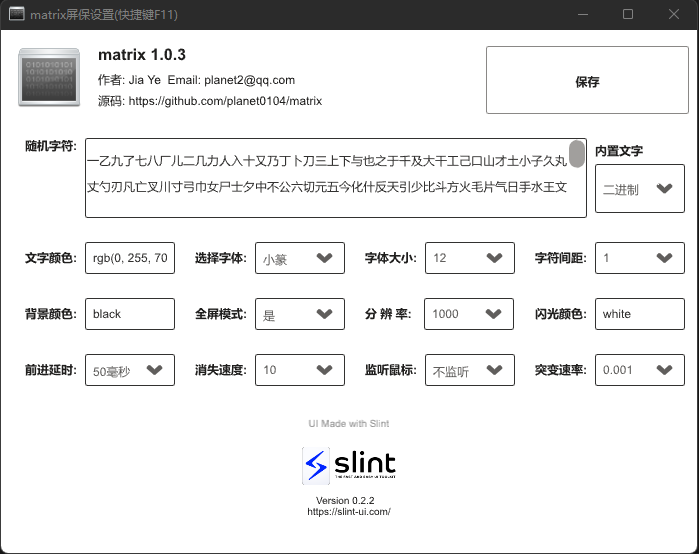
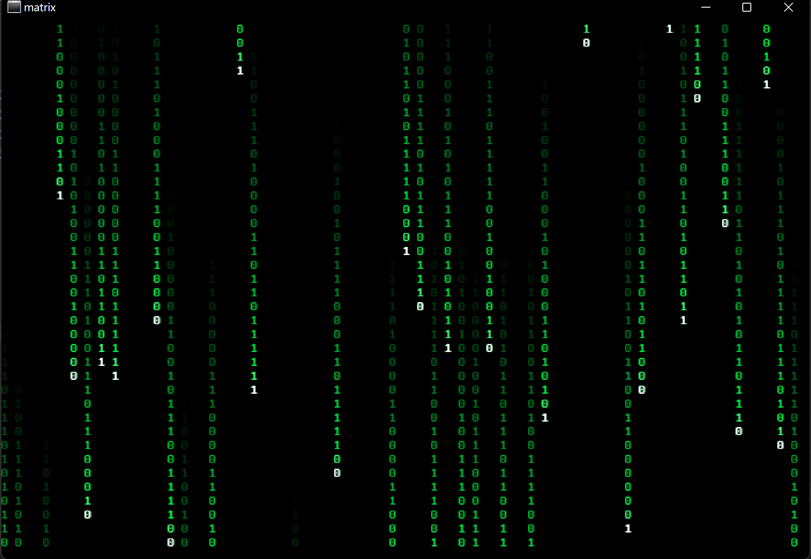

# matrix 屏保

## 下载地址

下载地址： [Releases](https://github.com/planet0104/matrix/releases)

## 安装屏保

右键点击matrix.scr，选择“安装”

打开屏幕保护程序，选择matrix

## 设置界面
*在屏幕保护程序设置界面，点击“设置”按钮打开屏保设置对话框*

## 其他快捷键

**F1** >> 设置

**F11** >> 进入/退出全屏

**ESC** >> 退出程序(或者移动鼠标600ms)

## 运行截图

