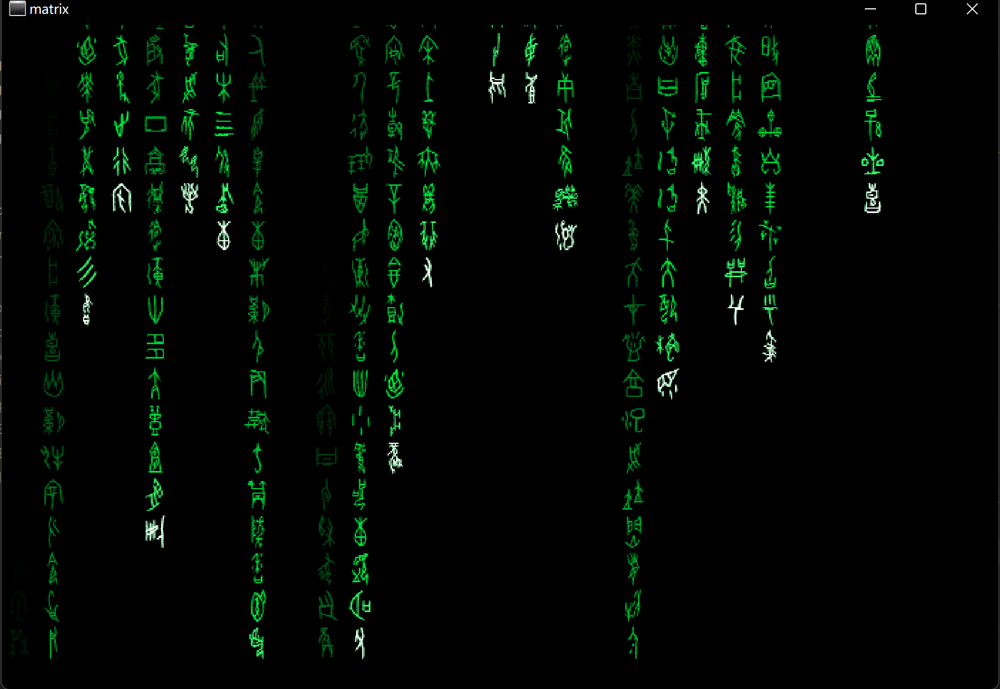

# matrix
[](https://github.com/planet0104/matrix/releases)
## 配置文件 Config.toml
```toml
#随机字符
characters = "0123456789"

# 字体 "1"->凤凰点阵体 "2"->小篆 "3"->甲骨文 "字体文件名.ttf"->自定义ttf文件
font = "1"

# font = "fonts/VonwaonBitmap-16px.ttf"
# 字号
font_size = 16

# 字符上下间距
spaceing = 0

# 字符突变率 0不突变
mutation_rate = 0.005

# 消失延时
fade_delay=10

# 前进延时
step_delay=100

# 文字颜色
# color="rgb(0, 255, 70)"

# 背景色
# background="#000"

# 全屏模式
fullscreen=true

# 窗口大小
window_width=640
window_height=480
```

## 运行截图





